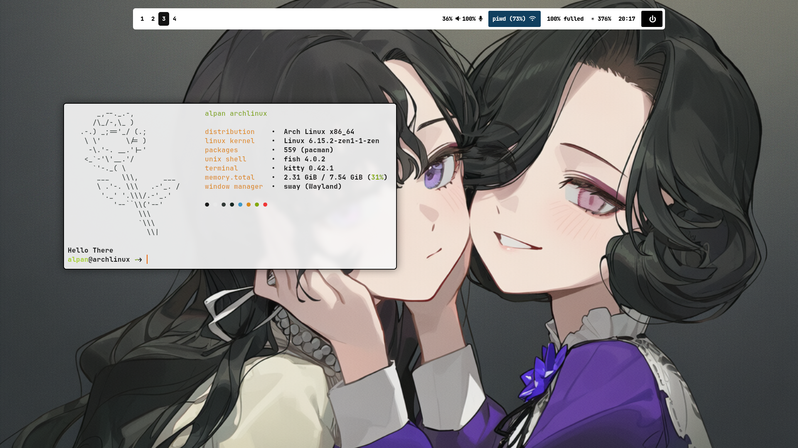

# 🧠 Arch Linux Dotfiles

Dotfiles pribadi saya untuk setup Arch Linux yang ringan, estetis, dan fungsional. Menggunakan **SwayWM** sebagai window manager utama berbasis **Wayland**, dengan integrasi beberapa tools modern seperti Waybar, Wofi, Fastfetch, dan Fish Shell.

---




---

## 📦 Tools yang Digunakan

| Tool        | Deskripsi |
|-------------|-----------|
| **SwayWM**  | Window manager berbasis Wayland, mirip i3 namun modern. |
| **Waybar**  | Status bar modular untuk Wayland, sangat fleksibel dan bisa ditambahkan skrip sendiri. |
| **Wofi**    | Launcher aplikasi ringan dan cepat, alternatif Rofi untuk Wayland. |
| **Wlogout** | GUI untuk menu logout dengan tampilan blur dan bisa dikustom. |
| **Fish**    | Shell interaktif yang modern dan user-friendly. |
| **Kitty**   | Terminal emulator berbasis GPU, cepat dan mendukung ligatures. |
| **Fastfetch** | Penampil informasi sistem estetis di terminal (pengganti Neofetch). |

---

## 🗂️ Struktur Direktori

```bash
.
├── fastfetch         # Konfigurasi Fastfetch
│   ├── config.jsonc  # Konfigurasi utama Fastfetch
│   └── rose.txt      # ASCII art bunga custom
├── fish              # Konfigurasi shell Fish
│   ├── config.fish
│   ├── functions/
│   ├── conf.d/
│   ├── completions/
│   └── fish_variables
├── kitty             # Konfigurasi terminal Kitty
│   ├── kitty.conf
│   └── theme.conf
├── screenshot        # Cuplikan layar setup
│   ├── 1.png
│   ├── 2.png
│   └── 3.png
├── sway              # Konfigurasi SwayWM
│   ├── config
│   └── scripts/
│       └── screenshot.sh
├── waybar            # Status bar config
│   ├── config.jsonc
│   ├── style.css
│   └── scripts/
│       ├── brightness-scroll.sh
│       ├── window_title.sh
│       └── wlogout-blur.sh
├── wlogout           # Tampilan logout GUI
│   ├── layout
│   └── style.css
└── wofi              # Launcher aplikasi (mirip Rofi)
    ├── config
    └── style.css
